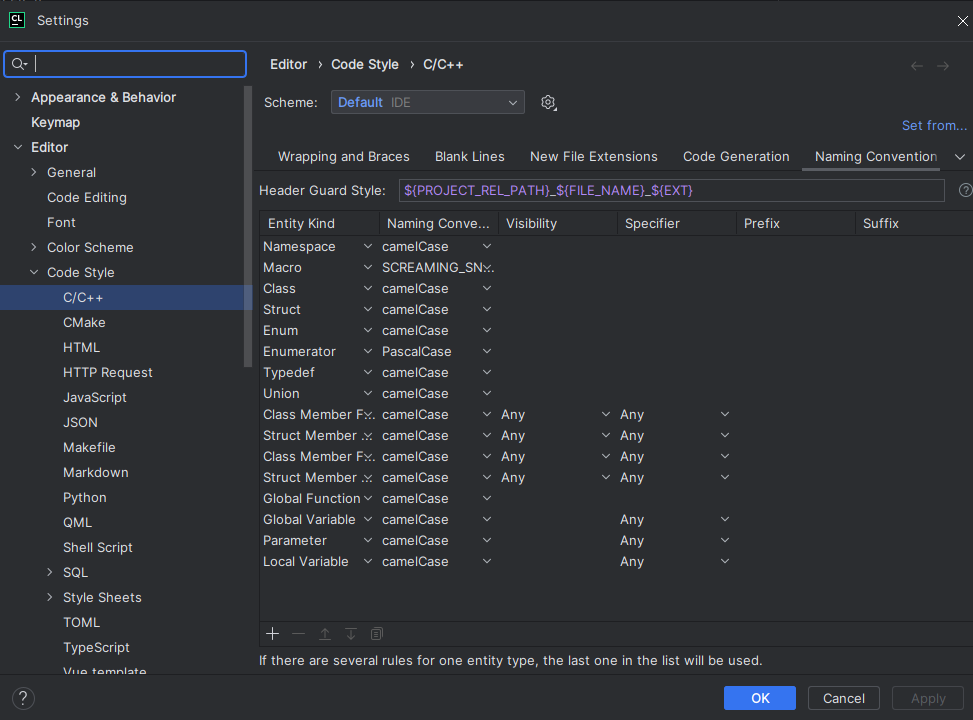
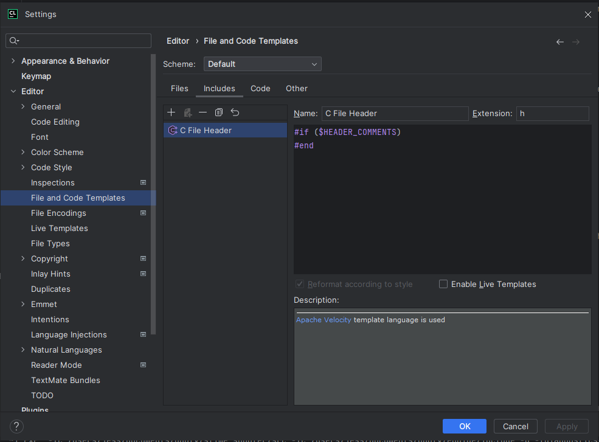

# Setting up project in CLion (MacOS/Unix, Windows)

## General information
This project has been configured and tested using CMake, CLion and various operating systems (Windows 10, MacOS, Debian and Arch-based linux distributions). 
It is recommended to follow the below steps and configuration for the best result.

## 1: Clean install
1. Clone repository
2. Open the root project directory in CLion (the directory containing the `engine`, `slime_shooter` etc directories)
3. Accept default debug configuration prompt leaving all settings as default.

## 2: Building and running the project initially
- In the CLion menu there's a `Build` option and then a `Rebuild Project` option. Run this.
  
- Now you can run the project, set it at the slime_shooter configuration and press on the green right-pointing arrow.
  
  - Running the project is always done like this.
- **Note:** the MacOS version of CLion is used in the above screenshots, the UI will be slightly different depending on your OS.

### run.sh script
Anecdotally, on some operating systems such as Arch Linux, running the project through CLion does not display a window. There is a
`install.sh` script included in this repository that can be ran to run the (already built through CLion) project. Give it the correct
permission `chmod +x run.sh` and then run it `./run.sh`. 
The script will make sure the current directory is the root build output so any paths used in the application are correct.

## 3: Development

### 3.1 CLion configuration
There are a few things required to get CLion configured correctly:

- **Enable Google coding standards**
  - `Open Settings > Editor > Code Style > C/C++ > Set From > Google > Apply > OK`
  - https://www.jetbrains.com/help/clion/predefined-code-styles.html
- **Change Header Guard Style**
  - By default CLion picks the "root" project name for the header guards, but we want to have it so that each project has them formatted based on their respective project name.
  - `Open Settings > Editor > Code Style > C/C++ > Scroll to the right in the menu and select Naming Convention > Make sure the Header Guard Style input contains the below text:`
  - `${PROJECT_REL_PATH}_${FILE_NAME}_${EXT}`
  - 
- **Disable auto-generated author information**
  - Open Settings > Editor > File and Code Templates > Includes > Enter the below data:
  - `#if ($HEADER_COMMENTS) #end`
  - 

### 3.2 Working with the projects
The project contains two project you will be working with:
- slime_shooter
- engine

You can select which project configuration you want to use at the top right of the IDE (where the green arrow/run button is located at).
General recommendations:
- If you're working on the engine, switch to the `engine` configuration.
- If you're working on the game, switch to the `slime_shooter` configuration.  
- Generally it still makes sense to always `Rebuild Project` or `Rebuild all in Debug` in the `Build` menu to ensure everything gets built correctly.

