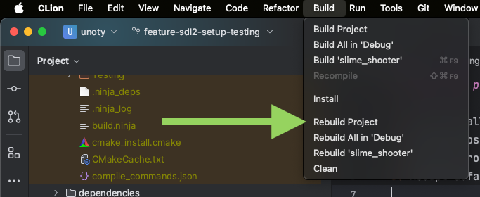
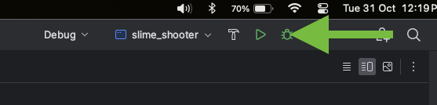

# Setting up project in CLion (MacOS/Unix, Windows)

## General information
This project has been configured and tested using CMake, CLion and various operating systems (Windows 10, MacOS, Debian and Arch-based linux distributions). 
It is recommended to follow the below steps and configuration for the best result.

## 1: Clean install
1. Clone repository
2. Open the root project directory in CLion (the directory containing the `engine`, `slime_shooter` etc directories)
3. Accept default debug configuration prompt leaving all settings as default.

## 2: Building and running the project
- In the CLion menu there's a `Build` option and then a `Rebuild Project` option. Run this.
  
- Now you can run the project, set it at the slime_shooter configuration and press on the green right-pointing arrow.
  
  - Running the project is always done like this.
- **Note:** the MacOS version of CLion is used in the above screenshots, the UI will be slightly different depending on your OS.

## 3: run.sh script
Anecdotally, on some operating systems such as Arch Linux, running the project through CLion does not display a window. There is a
`install.sh` script included in this repository that can be ran to run the (already built through CLion) project. Give it the correct
permission `chmod +x run.sh` and then run it `./run.sh`. 
The script will make sure the current directory is the root build output so any paths used in the application are correct.